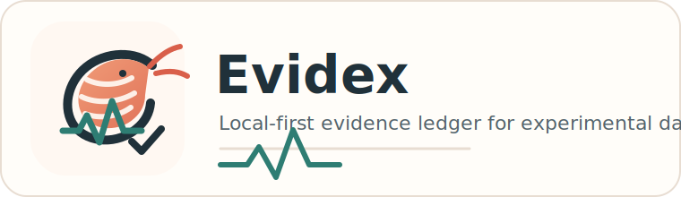
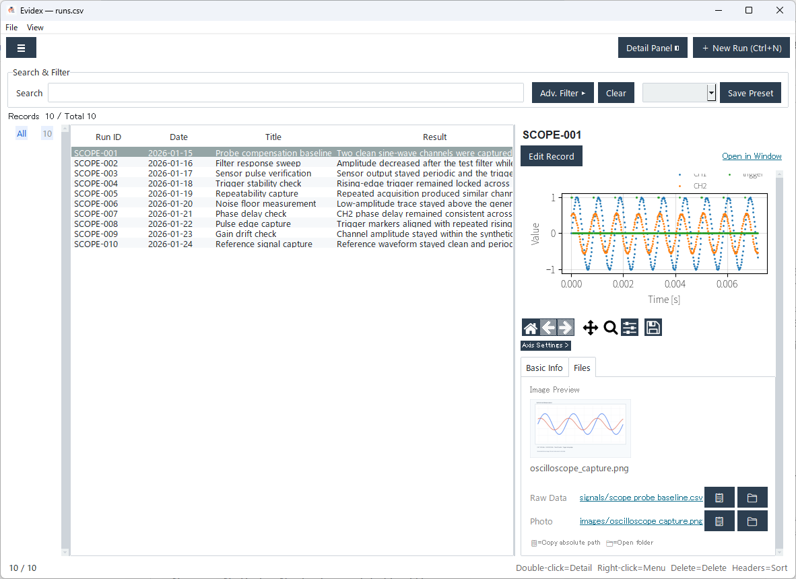

# Evidex



**Turn scattered lab files into searchable experiment evidence.**

Your instrument CSVs, spreadsheets, photos, and notes are already on disk — Evidex connects them into a searchable record without moving or modifying anything.

No server. No cloud. Just local files and a single EXE.



## Download

**[Windows (64-bit) — Evidex-v0.1.0-win.zip](https://github.com/jyun-lab/Evidex/releases/latest/download/Evidex-v0.1.0-win.zip)**

Unzip, run `Evidex.exe`, done. The ZIP includes synthetic demo data so you can explore immediately.

Or run from source with Python 3.8+:

```bash
python evidex_app.py
```

## Features

- **Search & filter** experiment records stored in local CSV ledgers
- **Link files** — raw CSVs, spreadsheets, photos, notebooks per record
- **Waveform preview** — plot time-series CSVs without opening another tool
- **Image preview** — thumbnails of linked photos in the detail pane
- **Pack Manager** — define CSV reading rules from the GUI, no Python needed
- **Procedure steps** — record what you did in each experiment
- **Research series** — group related records and track what's established vs. unresolved
- **English / Japanese** UI

## How It Works

Evidex separates your experiment context into three layers.

| Layer | What it contains |
|---|---|
| Original files | Instrument CSVs, spreadsheets, photos, notebooks |
| Search metadata | `runs.csv`, `steps.csv`, `series.csv` |
| Instrument packs | CSV reading rules and optional workflow features |

Original files are never moved or rewritten. Evidex stores paths and metadata so you can search, inspect, and reopen the files later.

## Quick Start

### Windows EXE

1. [Download the ZIP](https://github.com/jyun-lab/Evidex/releases/latest/download/Evidex-v0.1.0-win.zip) and extract it.
2. Run `Evidex.exe`. The bundled demo data loads automatically.
3. Click a record to see its waveform and linked files.

### From source

```bash
python evidex_app.py
```

For waveform previews and a polished theme, install the optional dependencies:

```bash
pip install ttkbootstrap matplotlib
```

Then try the synthetic demo in [`examples/demo`](examples/demo/).

## Set Up Your Own CSV

If your measurement CSV has a header row, you can configure it without writing code:

1. **File > Pack Manager** → **+ New Pack**
2. Go to **CSV & Waveform** → **Choose Sample CSV**
3. Pick the X-axis column (time, wavelength, etc.) and one or more graph columns
4. **Apply CSV Settings** → **Test Import** → **Save**

Comma, tab, and semicolon delimiters are detected automatically. Files with extra rows above the header can be handled with **Rows to skip**.

## Instrument Packs

The public build includes `generic_ts`, a starting point for CSV data with one X column and one or more measurement columns.

Labs can add their own instrument-specific workflows as local user packs under `packs/<pack_name>/`. Packs can enable features like procedure steps, research series, evidence grading, baseline correction, and channel groups.

## Data Safety

- Original files are never modified.
- Metadata is plain CSV — no proprietary database.
- Every save creates a timestamped backup first.
- User packs and local ledgers are excluded from Git by default.

## Build a Windows Executable

```bash
pip install pyinstaller ttkbootstrap matplotlib
python build.py
```

Output: `dist/Evidex.exe`.

## License

[MIT License](LICENSE)

## Links

- [Releases](https://github.com/jyun-lab/Evidex/releases)
- [Synthetic demo data](examples/demo/)
- [Release checklist](docs/RELEASE_CHECKLIST.md)

